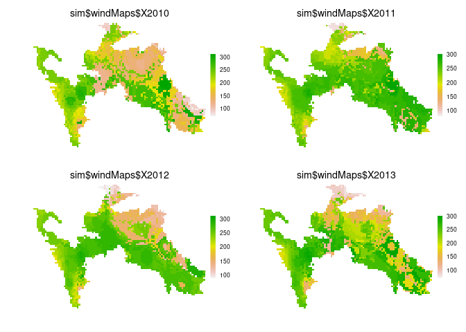

```r
if (!require("BioSIM")) {
  ## package BioSIM not available on CRAN nor GitHub; needs to be installed as follows:
  install.packages("https://sourceforge.net/projects/repiceasource/files/latest",
                   repos = NULL,  type = "source")
  install.packages("https://sourceforge.net/projects/biosimclient.mrnfforesttools.p/files/latest",
                   repos = NULL,  type = "source")
}

library("Require")
Require(c(
  "PredictiveEcology/reproducible@development",
  "PredictiveEcology/SpaDES.core@development"#,
  #"PredictiveEcology/LandR@development"
))
```

```
## PredictiveEcology/reproducible@development 
##                                       TRUE 
##  PredictiveEcology/SpaDES.core@development 
##                                       TRUE
```

# Overview

Import/use wind projections from BioSIM.

# Usage


```r
scratchDir <- checkPath("~/scratch/canWind", create = TRUE)

raster::rasterOptions(default = TRUE)
options(
  rasterMaxMemory = 5e+12,
  rasterTmpDir = scratchDir,
  reproducible.cacheSaveFormat = "qs"
)

setPaths(
  cachePath = checkPath(file.path(scratchDir, "cache"), create = TRUE),
  modulePath = file.path(".."),
  inputPath = "data",
  outputPath = "outputs"
)

times <- list(start = 2010, end = 2013)

parameters <- list(
  canWind = list(
    climateModel = "GCM4",
    climateScenario = "RCP45",
    .plotInitialTime = times$start,
    .plotInterval = NA,
    .tempdir = scratchDir,
    years = seq(times$start, times$end, 1)
  )
)
modules <- list("canWind")
objects <- list()
inputs <- list()
outputs <- list()

mySimOut <- simInitAndSpades(times = times, params = parameters, modules = modules, objects = objects)
```

<!-- -->

```r
J4R::shutdownClient()
```

# Parameters

Provide a summary of user-visible parameters.


|paramName        |paramClass |default      |min  |max  |paramDesc                                                                                       |
|:----------------|:----------|:------------|:----|:----|:-----------------------------------------------------------------------------------------------|
|aggFact          |integer    |40           |NA   |NA   |Aggregation/diaggregation factor to use to rescale wind maps (i.e., to use coarser resolution). |
|climateModel     |character  |GCM4         |NA   |NA   |The climate model to use. One of 'GCM4' or 'RCM4'                                               |
|climateScenario  |character  |RCP45        |NA   |NA   |The climate scenario to use. One of 'RCP45' or 'RCP85'.                                         |
|.plots           |character  |             |NA   |NA   |TODO: description needed                                                                        |
|.plotInitialTime |numeric    |start(sim)   |1981 |2100 |This describes the simulation time at which the first plot event should occur                   |
|.plotInterval    |numeric    |NA           |NA   |NA   |This describes the simulation time interval between plot events                                 |
|.saveInitialTime |numeric    |NA           |NA   |NA   |This describes the simulation time at which the first save event should occur                   |
|.saveInterval    |numeric    |NA           |NA   |NA   |This describes the simulation time interval between save events                                 |
|.tempdir         |character  |             |NA   |NA   |Temporary (scratch) directory to use for transient files (e.g., GIS intermediates).             |
|.useCache        |logical    |FALSE        |NA   |NA   |Should this entire module be run with caching activated?                                        |
|years            |numeric    |1981, 19.... |NA   |NA   |sequence of years to get wind data/projections for.                                             |

# Events

Describe what happens for each event type.

## Init

TODO

## Input data

How to obtain input data, and a description of the data required by the module.
If `sourceURL` is specified, `downloadData("canWind", "..")` may be sufficient.


|objectName    |objectClass     |desc                                                                  |sourceURL                                                                                                                                                                                   |
|:-------------|:---------------|:---------------------------------------------------------------------|:-------------------------------------------------------------------------------------------------------------------------------------------------------------------------------------------|
|rasterToMatch |RasterLayer     |if not supplied, will default to standAgeMap                          |NA                                                                                                                                                                                          |
|standAgeMap   |RasterLayer     |stand age map in study area, default is Canada national stand age map |http://ftp.maps.canada.ca/pub/nrcan_rncan/Forests_Foret/canada-forests-attributes_attributs-forests-canada/2001-attributes_attributs-2001/NFI_MODIS250m_2001_kNN_Structure_Stand_Age_v1.tif |
|studyArea     |SpatialPolygons |The study area to which all maps will be cropped and reprojected.     |NA                                                                                                                                                                                          |

## Output data

Description of the module outputs.


|objectName |objectClass |desc                                                   |
|:----------|:-----------|:------------------------------------------------------|
|windMaps   |RasterStack |Raster maps corresponding to wind speed and direction. |

# Links to other modules

This module prepares data layers for use with MPB red top spread module (<https://github.com/achubaty/mpbRedTopSpread>).
